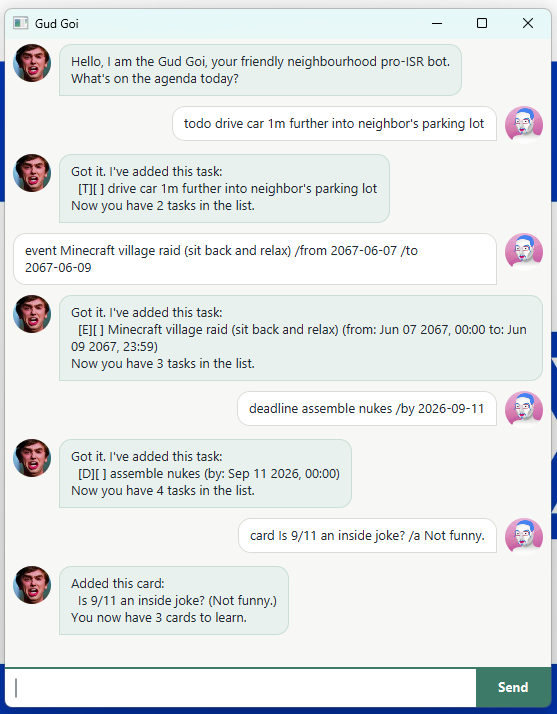

# Gud Goi User Guide



Gud Goi keeps your agenda and quizzes you on things you want to remember. You
type a line, it answers. Your tasks and cards are written to disk after every
change, so they are still there the next time you start.

## Getting started

1. Make sure you have Java 17 or later.
2. Download `gudgoi.jar` from the
   [latest release](https://github.com/Bruhmiuz/ip/releases).
3. Put it in a folder of its own. Gud Goi makes a `data` folder beside the jar
   and keeps your agenda and your cards there.
4. Run it:

   ```
   java -jar gudgoi.jar
   ```

Type a command and press Enter, or click **Send**.

## How to write a date

Anywhere a command asks for a time, write either:

* a date on its own — `2026-09-18`
* or a date and a 24-hour time — `2026-09-18 2359`

A deadline with no time is due at midnight. An event with no end time runs to
`23:59` of the day you gave.

Nothing else is accepted. `next Friday` and `18/9/2026` are refused.

## Tasks

### Add a todo — `todo`

Something to do, with no date attached.

```
todo read week 6
```

```
Got it. I've added this task:
  [T][ ] read week 6
Now you have 1 task in the list.
```

### Add a deadline — `deadline`

Something due at a particular time.

```
deadline submit iP /by 2026-09-18 2359
```

```
Got it. I've added this task:
  [D][ ] submit iP (by: Sep 18 2026, 23:59)
Now you have 2 tasks in the list.
```

### Add an event — `event`

Something that runs between two times. Gud Goi refuses an event that ends
before it starts.

```
event tutorial /from 2026-09-19 1400 /to 2026-09-19 1500
```

```
Got it. I've added this task:
  [E][ ] tutorial (from: Sep 19 2026, 14:00 to: Sep 19 2026, 15:00)
Now you have 3 tasks in the list.
```

### See everything — `list`

```
list
```

```
1.[T][ ] read week 6
2.[D][ ] submit iP (by: Sep 18 2026, 23:59)
3.[E][ ] tutorial (from: Sep 19 2026, 14:00 to: Sep 19 2026, 15:00)
```

`[T]`, `[D]` and `[E]` are the three kinds of task. The second box is `[X]`
when the task is done and `[ ]` when it is not.

### Mark a task done, or not done — `mark`, `unmark`

Use the number that `list` shows.

```
mark 1
```

```
Nice! I've marked this task as done:
  [T][X] read week 6
```

```
unmark 1
```

```
OK, I've marked this task as not done yet:
  [T][ ] read week 6
```

### Delete a task — `delete`

```
delete 2
```

```
Noted. I've removed this task:
  [D][ ] submit iP (by: Sep 18 2026, 23:59)
Now you have 2 tasks in the list.
```

### Search — `find`

Shows every task whose description holds the word. Capitals do not matter.

Each result keeps the number it has in the full list, so you can type
`mark 3` against what you see without counting again.

```
find week
```

```
Here are the matching tasks in your list:
1.[T][ ] read week 6
```

## Trivia cards

Cards are separate from your tasks. They live in their own file, so damage to
one cannot cost you the other.

### Add a card — `card`

```
card capital of France /a Paris
```

```
Added this card:
  capital of France (Paris)
You now have 1 card to learn.
```

### See the deck — `cards`

```
cards
```

```
Here are your cards:
1.capital of France (Paris)
```

### Delete a card — `deletecard`

```
deletecard 1
```

### Test yourself — `quiz`

Asks one card, picked at random.

```
quiz
```

```
Quiz: capital of France
Type your answer.
```

**The next line you type is your answer, whatever it says.** Type `list` while
a question is waiting and it is marked as a wrong answer, not run as a command.
Only `bye` escapes a waiting question.

```
Paris
```

```
Correct.
  capital of France = Paris
Type quiz for another.
```

Capitals and surrounding spaces are ignored, so `  paris  ` is also correct.
The answer is shown whether you got it right or wrong, because a card you
missed is the one you most need to read.

One `quiz` asks exactly one question. Type `quiz` again for another.

### Leave — `bye`

```
bye
```

Gud Goi says goodbye and the window closes a moment later.

## When something goes wrong

A refused command is shown in **red**, with a heavier border, so you can see it
without reading it. Every other reply is shown in the ordinary style.

Gud Goi tells you what it expected. For example, a `deadline` with no `/by`
part answers with a working example you can copy.

## Your data

| File | Holds |
| --- | --- |
| `data/saved.txt` | your tasks |
| `data/cards.txt` | your cards |

Both are plain text and are rewritten after every change that succeeds.

Three things are worth knowing:

* **Run one copy at a time, and do not edit the files by hand while it runs.**
  Gud Goi reads a file once, when it starts, and writes the whole file back
  after every change. It never re-reads. So an edit made from outside while
  Gud Goi is running is invisible to it, and the next change you make
  overwrites that edit without warning. Two copies of Gud Goi running in the
  same folder will destroy each other's work the same way. Close it before you
  edit a file by hand.
* **A change that cannot be saved is undone.** If the file cannot be written,
  Gud Goi puts your list back the way it was and tells you. What you see on
  screen always matches what is on disk.
* **A damaged file is deleted, not half-read.** If any line of a save file does
  not match the format, Gud Goi deletes the whole file, tells you, quotes the
  line it could not read, and starts with an empty list. Half an agenda read
  out of a damaged file is worse than none, because you cannot see what is
  missing.

## Command summary

| Command | Format |
| --- | --- |
| Add a todo | `todo DESCRIPTION` |
| Add a deadline | `deadline DESCRIPTION /by DATE [TIME]` |
| Add an event | `event DESCRIPTION /from DATE [TIME] /to DATE [TIME]` |
| List tasks | `list` |
| Mark done | `mark NUMBER` |
| Mark not done | `unmark NUMBER` |
| Delete a task | `delete NUMBER` |
| Search | `find KEYWORD` |
| Add a card | `card QUESTION /a ANSWER` |
| List cards | `cards` |
| Delete a card | `deletecard NUMBER` |
| Start a quiz | `quiz` |
| Leave | `bye` |
